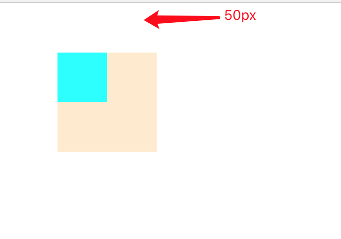

## box 有几种模型

border-box content-box

IE 盒模型与 W3C 标准盒模型

## 怎么更改 box 类型

box-sizing： border-box || content-box || inherit

## 块元素 行内元素 都有哪些

- 块元素 div h1~h6 hr//水平分割线 ol p pre table ul
- 行内元素 a br em img label input select span textarea

## span 标签设置 padding 50px 在浏览器中什么表现 画出来

body margin:0 padding:0，
这一题主要注意内联元素 martin-top，padding-top 不生效哦

## 展现形式 画出来

```javascript
<div class='main'>
    <div class='child'></div>
</div>
<style>
    .main{
        margin-left: 50px;
        width: 100px;
        height: 100px;
    }
    .child{
        margin-top:50px;
        width:50px;
        height:50px;
    }
</style>
```



发生 margin 重叠的情况 **必须 block 元素**

- 相邻兄弟元素
- 父级和第一个 / 最后一个子元素
- 空的 block 元素
- [margin 重叠](https://github.com/lishengzxc/bblog/issues/18)

## 三列自适应布局 高为屏幕高度

```html
<!DOCTYPE html>
<html lang="en">

<head>
    <meta charset="UTF-8">
    <meta name="viewport" content="width=device-width, initial-scale=1.0">
    <meta http-equiv="X-UA-Compatible" content="ie=edge">
    <title>Document</title>
    <style>
        html,
        body {
            margin: 0;
            padding: 0;
            height: 100%;
        }

        #main {
            width: 100%;
            height: 100%;
            float: left;
        }

        #main #content {
            margin: 0 210px;
            height: 100%;
            background-color: yellow;
        }

        #left,
        #right {
            width: 200px;
            height: 100%;
            float: left;

        }

        #left {
            margin-left: -100%;
            background-color: red;
        }

        #right {
            margin-left: -200px;
            background: pink;
        }
    </style>
</head>

<body>
    <div id="main">
        <div id="content">1</div>
    </div>
    <div id="left">2</div>
    <div id="right">3</div>
</body>

</html>
```

## 说出执行过程

```
alert(test);
var test = 1;
function test(){console.log()}
```

- 变量声明提升：通过 var 声明的变量在代码执行之前被 js 引擎提升到了当前作用域的顶部。
- 函数声明提升：通过函数声明的方式（非函数表达式）声明的函数在代码执行之前被 js 引擎提升到了当前作用域的顶部，而且函数声明提升优先于变量声明提升。

## 两个数组找出相同元素 写出你认为最简单的方法

1. undersore _.intersection([],[]) _.difference()

```javascript
let a1 = [1, 3, 4, 5, 6, 8, 9];
let a2 = [2, 3, 4, 5, 6];
let as1 = new Set(a1);
let as2 = new Set(a2);

let union = new Set([...as1, ...as2]);
let common = new Set([...as1].filter(x => as2.has(x)));
let diff = new Set([...as1].filter(x => !as2.has(x)));
console.log(Array.from(union));
console.log(Array.from(common));
console.log(Array.from(diff));
```

## 写出获取 li 中 id 的代码

```html
<ul>
  <li id=0></li>
  <li id=1></li>
  <li id=2></li>
  <li id=3></li>
</ul>
```

向父元素添加监听事件，事件委托。
点击时获取：`e.target.id`

## 红包抽奖算法，

比如 200 元，20 个红包，保证每个红包都要大于 5 元 大概就这个意思

## 两个有序数组，合并之后还是有序的，

要求算法复杂度是 o(n), 也有可能说不让你用 for 循环，不用 for 循环就用递归吧

```javascript
function mergeArray(arr1, arr2) {
  var ind1 = 0; //标记arr1的对比元素的初始索引值
  var ind2 = 0; //标记arr2的对比元素的初始索引值
  var arr = []; //作为输出的新数组
  while (ind1 < arr1.length && ind2 < arr2.length) {
    //当arr1和arr2元素均未全部存入arr中，则从第一个元素开始进行比较，将较小的那个元素存入arr
    if (arr1[ind1] <= arr2[ind2]) {
      arr.push(arr1.slice(ind1, ind1 + 1)[0]); //若arr1的对比元素小于arr2的对比元素，则将arr1的对比元素存入arr中
      ind1++;
    } else {
      arr.push(arr2.slice(ind2, ind2 + 1)[0]);
      ind2++;
    }
  }
  while (ind1 < arr1.length) {
    //当arr2的元素已全部存入arr中，则直接将arr1剩余的所有元素依次存入arr
    arr.push(arr1.slice(ind1, ind1 + 1)[0]);
    ind1++;
  }
  while (ind2 < arr2.length) {
    //当arr1的元素已全部存入arr中,则直接将arr2剩余的所有元素依次存入arr
    arr.push(arr2.slice(ind2, ind2 + 1)[0]);
    ind2++;
  }
  return arr;
}

console.log(mergeArray([1, 2, 3], [2, 4, 5]));

var arrs = [[1, 2], [0, 3, 4, 5], [-1, 4]];

/**
 * @param {Array[]} arrs
 * @param {boolean=false} [isUnique]
 * @param {Function=(a, b) => a - b} [compare]
 * @returns {Array}
 */
function join(arrs, isUnique = false, compare = (a, b) => a - b) {
  if (!Array.isArray(arrs)) {
    return [];
  }

  var result = [];

  arrs.forEach(arr1 => {
    arr1 = Array.isArray(arr1) ? arr1.slice() : [arr1];
    let arr2 = result;
    result = [];

    while (arr1.length > 0 && arr2.length > 0) {
      result.push(compare(arr1[0], arr2[0]) <= 0 ? arr1.shift() : arr2.shift());
    }

    result = result.concat(arr1, arr2);

    if (isUnique) {
      result = Array.from(new Set(result));
    }
  });

  return result;
}

console.log(join(arrs)); // [ -1, 0, 1, 2, 3, 4, 4, 5 ]
console.log(join(arrs, true)); // [ -1, 0, 1, 2, 3, 4, 5 ]
```

## http 缓存

- [http 缓存 google](https://developers.google.com/web/fundamentals/performance/optimizing-content-efficiency/http-caching?hl=zh-cn)

- [http 缓存 MDN](https://developer.mozilla.org/zh-CN/docs/Web/HTTP/Caching_FAQ)

- [http 缓存 tencent](https://mp.weixin.qq.com/s/qOMO0LIdA47j3RjhbCWUEQ)

## h5 特性（svg, localstorage, sessionStorage )
